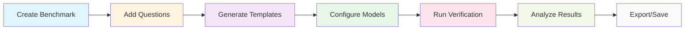

# Karenina

<div align="center">

[](https://www.python.org/downloads/)
[](https://opensource.org/licenses/MIT)
[](https://github.com/astral-sh/ruff)
[](http://mypy-lang.org/)

**A comprehensive benchmarking system for Large Language Models (LLMs)**

[Quick Start](#-quick-start) • [Installation](#-installation) • [Documentation](#-documentation) • [Contributing](#-contributing)

</div>

## 🎯 About Karenina

Karenina is a framework designed to standardize domain expertise and concepts into runnable benchmarks. The core challenge Karenina addresses is: *making the formulation of domain-specific benchmarks accessible to non-LLM-technical experts, allowing them to focus their time and expertise on knowledge rather than infrastructure.*

**Key Concepts:**

- **Benchmarks** are expressed as **parametrizable code templates**, which can be evaluated with an **LLM-as-a-judge** model to evaluate performance
- **Standardized schema** (building on existing standards such as *schema.org*) enables rich, consistent, and extensible benchmark definitions
- **Tools to generate benchmarks at scale** while maintaining quality and consistency
- **JSON-LD format** enables seamless integration between Python library and GUI interface

At the heart of Karenina is the notion of a **template**. A template describes both the **question/task** to be posed to a model and the **structure of the expected answer**. By enforcing structured outputs, Karenina ensures that benchmarks are not only reproducible but also programmatically evaluable.

## 🧠 The Karenina Strategy

Traditional LLM evaluation faces a dilemma: either constrain the answering model's output (limiting naturalness) or use free-text evaluation (introducing parsing ambiguity).

Karenina adopts a **third approach** that combines the advantages of both:

- The **answering model** remains unconstrained, generating natural free text
- The **judge model** is required to return results in a **structured format** (JSON), validated through a Pydantic class

This setup allows the judge to flexibly interpret free text while ensuring that its own output remains standardized and machine-readable.

### Example Workflow

**1. Answering model output (free text):**
```
"The capital of Italy is Rome."
```

**2. Pydantic template definition:**
```python
class Answer(BaseAnswer):
    answer: str = Field(description="The name of the city in the response")

    def model_post_init(self, __context):
        self.correct = {"answer": "Rome"}

    def verify(self) -> bool:
        return self.answer == self.correct["answer"]
```

**3. Judge model output (structured JSON):**
```json
{"answer": "Rome"}
```

**4. Verification:**
```python
populated_answer = Answer(**judge_answer)
result = populated_answer.verify()  # True
```

## 📦 Installation

### Using uv (recommended)
```bash
uv add karenina
```

### Using pip
```bash
pip install karenina
```

### Environment Setup
Set up your LLM provider API keys:

```bash
# OpenAI
export OPENAI_API_KEY="your-openai-api-key"

# Google (Gemini)
export GOOGLE_API_KEY="your-google-api-key"

# Anthropic (Claude)
export ANTHROPIC_API_KEY="your-anthropic-api-key"

# OpenRouter (optional)
export OPENROUTER_API_KEY="your-openrouter-api-key"
```

## 🚀 Quick Start

Get started with Karenina in just a few minutes! This guide will walk you through creating your first benchmark, adding questions, configuring models, and running verification.

### 1. Create a Benchmark

```python
from karenina import Benchmark

# Create a new benchmark
benchmark = Benchmark.create(
    name="Test benchmark",
    description="Simple quick intro",
    version="1.0.0",
    creator="Karenina Example",
)
```

### 2. Add Questions

```python
# Add questions manually
question = "What is the capital of France?"
raw_answer = "Paris"

# Define the answer template manually
template_code = '''class Answer(BaseAnswer):
    answer: str = Field(description="the name of the city in the response")

    def model_post_init(self, __context):
        self.correct = {"answer": "Paris"}

    def verify(self) -> bool:
        return self.answer == self.correct["answer"]'''

# Add the question to the benchmark
qid = benchmark.add_question(
    question=question,
    raw_answer=raw_answer,
    answer_template=template_code,
    finished=True,  # Mark as ready for verification
    author={"name": "Example Author", "email": "author@example.com"},
)
```

### 3. Configure Models

```python
from karenina.benchmark import ModelConfig, VerificationConfig

# Set up model configuration
answering_models = [
    ModelConfig(
        id="gemini-2.5-flash",
        model_provider="google_genai",
        model_name="gemini-2.5-flash",
        temperature=0.1,
        interface="langchain",
        system_prompt="You are a helpful assistant."
    )
]

parsing_models = [
    ModelConfig(
        id="gemini-2.5-flash",
        model_provider="google_genai",
        model_name="gemini-2.5-flash",
        temperature=0.0,
        interface="langchain",
        system_prompt="You are an LLM judge and, given a template, will judge the answer to the question"
    )
]

config = VerificationConfig(
    answering_models=answering_models,
    parsing_models=parsing_models
)
```

### 4. Run Verification

```python
# Run verification
results = benchmark.run_verification([qid], config)

# Save your benchmark
benchmark.save("my-first-benchmark.jsonld")
```

Congratulations! You've created your first Karenina benchmark.

## ✨ Key Features

### 🏗️ **Unified Benchmark API**
- Single `Benchmark` class handles entire workflow
- Intuitive methods: `create()`, `add_question()`, `run_verification()`, `save()`
- Complete question lifecycle management

### 📁 **JSON-LD Integration**
- Schema.org-based data format for standardization
- Seamless GUI/backend interoperability
- Round-trip data integrity between platforms

### ⚡ **Async Processing**
- Parallel LLM processing with configurable concurrency
- 5-10x performance improvement for large benchmarks
- Built-in rate limiting and error recovery

### 🧪 **Template System**
- Automatic Pydantic class generation from questions
- LLM-powered template creation
- Custom verification methods and granular scoring

### 📊 **Multi-Model Testing**
- Test multiple model combinations simultaneously
- Statistical analysis with replicate support
- Comprehensive result tracking and export

### 📏 **Rubric Evaluation**
- Global and question-specific rubrics
- Boolean and score-based evaluation criteria
- Qualitative assessment beyond correctness

### 🔌 **Multi-Provider Support**
- Unified interface for OpenAI, Google Gemini, Anthropic Claude, and OpenRouter
- Consistent API across different providers
- Easy provider switching and comparison

## 🏗️ Architecture

### High-Level Workflow


### Core Components

- **Core API** (`src/karenina/benchmark/`) - Unified Benchmark interface
- **LLM Interface** (`src/karenina/llm/`) - Multi-provider LLM abstraction
- **Question Processing** (`src/karenina/questions/`) - File extraction and management
- **Template System** (`src/karenina/answers/`) - Pydantic class generation
- **Verification Engine** (`src/karenina/benchmark/verification/`) - Parallel processing
- **Schemas** (`src/karenina/schemas/`) - Data models and JSON-LD format
- **Async Utilities** (`src/karenina/utils/`) - Parallel processing framework

## 📚 Advanced Usage

### Batch Question Processing

```python
# Extract questions from files
benchmark.load_questions_from_file("questions.csv")

# Generate templates for all questions
benchmark.generate_answer_templates(
    model_config=model_config,
    system_prompt="Create evaluation templates"
)
```

### Multi-Model Comparison

```python
# Test multiple models simultaneously
answering_models = [
    ModelConfig(id="gpt-4", model_provider="openai", model_name="gpt-4"),
    ModelConfig(id="gemini", model_provider="google_genai", model_name="gemini-2.5-flash"),
    ModelConfig(id="claude", model_provider="anthropic", model_name="claude-3-sonnet")
]

config = VerificationConfig(answering_models=answering_models, ...)
results = benchmark.run_verification(question_ids, config)
```

### Custom Rubrics

```python
# Add evaluation rubrics
benchmark.add_global_rubric_trait(
    name="clarity",
    description="Response clarity and organization",
    trait_type="score",
    scale=[1, 2, 3, 4, 5]
)
```

### Export Options

```python
# Export to different formats
benchmark.to_csv("results.csv")
benchmark.to_markdown("report.md")
benchmark.export_questions_python("questions.py")
```

## 🧪 Development & Testing

### Setup Development Environment

```bash
# Clone and setup
git clone https://github.com/biocypher/karenina.git
cd karenina

# Install with development dependencies using uv
make dev

# Run all quality checks
make check  # Runs lint, type-check, and tests
```

### Testing

```bash
# Run all tests
make test

# Run with coverage
make test-cov

# Run only changed tests
make test-changed
```

### Code Quality

```bash
make format     # Format code with ruff
make lint       # Lint with ruff
make type-check # Type checking with mypy
make dead-code  # Find unused code with vulture
```

## 📖 Documentation

For comprehensive guides and API documentation, visit our documentation:

- [**Installation Guide**](docs/install.md) - Set up Karenina on your system
- [**Quick Start Guide**](docs/quickstart.md) - Create your first benchmark
- [**Using Karenina**](docs/using-karenina/defining-benchmark.md) - Complete user guides
- [**API Reference**](docs/api-reference.md) - Full API documentation

## 🤝 Contributing

We welcome contributions! Please see our [Contributing Guidelines](./CONTRIBUTING.md) for details.

1. Fork the repository
2. Create a feature branch (`git checkout -b feature/amazing-feature`)
3. Commit your changes (`git commit -m 'Add amazing feature'`)
4. Push to the branch (`git push origin feature/amazing-feature`)
5. Open a Pull Request

## 📄 License

This project is licensed under the MIT License - see the [LICENSE](./LICENSE) file for details.

## 🙏 Acknowledgments

- Built with [LangChain](https://github.com/langchain-ai/langchain) for LLM orchestration
- Uses [Pydantic](https://github.com/pydantic/pydantic) for data validation and JSON-LD
- Tested with [pytest](https://github.com/pytest-dev/pytest)
- Formatted with [Ruff](https://github.com/astral-sh/ruff)

## 📮 Contact

For questions and support, please open an issue on [GitHub Issues](https://github.com/biocypher/karenina/issues).

---

<div align="center">
Made with ❤️ by the Karenina Team
</div>
