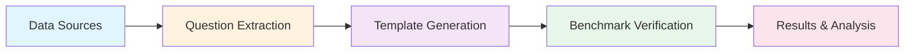

# Karenina

<div align="center">

[](https://www.python.org/downloads/)
[](https://opensource.org/licenses/MIT)
[](https://github.com/astral-sh/ruff)
[](http://mypy-lang.org/)

**A comprehensive benchmarking framework for Large Language Models (LLMs)**

[Features](#-features) • [Installation](#-installation) • [Quick Start](#-quick-start) • [Documentation](#-documentation) • [Contributing](#-contributing)

</div>

## 🎯 Overview

Karenina is a powerful Python library designed for systematic evaluation and benchmarking of Large Language Models. It provides a complete pipeline for extracting questions from various data sources, generating structured answer templates, and running comprehensive verification workflows to assess LLM performance.

### Why Karenina?

- **📊 Structured Evaluation**: Move beyond simple text comparison to structured, type-safe validation using Pydantic models
- **🔄 Multi-Provider Support**: Unified interface for OpenAI, Google Gemini, Anthropic Claude, and OpenRouter
- **📈 Scalable Benchmarking**: Test multiple model combinations with configurable replicates
- **✅ Qualitative Assessment**: Built-in rubric system for evaluating response quality beyond correctness
- **🎛️ Flexible Workflows**: Support for automated, semi-automated, and manual verification processes
- **📁 Multiple Formats**: Process questions from Excel, CSV, and TSV files

## ✨ Features

### Core Capabilities

- **Question Extraction**
  - Process Excel (.xlsx, .xls), CSV, and TSV files
  - Automatic MD5 hash generation for unique question IDs
  - Support for custom column mappings
  - Batch processing with progress tracking

- **Answer Template Generation**
  - Automatic Pydantic class generation from questions
  - Type-safe validation schemas
  - Custom verification methods
  - Granular scoring for multi-part answers

- **LLM Interface**
  - Unified API for multiple providers (OpenAI, Google, Anthropic, OpenRouter)
  - Session management for stateful conversations
  - Temperature and system prompt configuration
  - Error handling and retry logic

- **Benchmark Verification**
  - Multi-model testing configurations
  - Replicate support for statistical analysis
  - Parallel execution for performance
  - Comprehensive result tracking

- **Rubric Evaluation**
  - Boolean and score-based traits
  - Global and question-specific rubrics
  - Qualitative assessment beyond correctness
  - Customizable evaluation criteria

## 📦 Installation

### Using pip

```bash
pip install karenina
```

### Using uv (recommended)

```bash
uv add karenina
```

### Development Installation

```bash
# Clone the repository
git clone https://github.com/biocypher/karenina.git
cd karenina

# Install with development dependencies using uv
uv sync
uv pip install -e ".[dev]"

# Install pre-commit hooks
pre-commit install
```

## 🚀 Quick Start

### 1. Extract Questions from a File

```python
from karenina.questions.extractor import extract_and_generate_questions

# Extract questions from an Excel file
extract_and_generate_questions(
    file_path="data/benchmark_questions.xlsx",
    output_path="questions.py",
    question_column="Question",
    answer_column="Expected Answer",
    sheet_name="Sheet1"  # Optional for Excel files
)
```

### 2. Generate Answer Templates

```python
from karenina.answers.generator import generate_answer_template

# Generate a Pydantic answer template for validation
template_code = generate_answer_template(
    question="What is the capital of France?",
    raw_answer="Paris",
    model="gpt-4",
    model_provider="openai",
    temperature=0.0
)

print(template_code)
# Output: Pydantic class definition for answer validation
```

### 3. Run Benchmark Verification

```python
from karenina.benchmark.models import VerificationConfig, ModelConfiguration
from karenina.benchmark.verification.orchestrator import run_question_verification

# Configure models for testing
config = VerificationConfig(
    answering_models=[
        ModelConfiguration(
            id="gpt4",
            model_provider="openai",
            model_name="gpt-4",
            temperature=0.1,
            interface="langchain",
            system_prompt="You are an expert assistant."
        )
    ],
    parsing_models=[
        ModelConfiguration(
            id="gpt35",
            model_provider="openai",
            model_name="gpt-3.5-turbo",
            temperature=0.0,
            interface="langchain",
            system_prompt="Parse and validate the response."
        )
    ],
    replicate_count=3  # Run each test 3 times
)

# Run verification
results = run_question_verification(
    question_id="q1",
    question_text="What is the capital of France?",
    template_code=template_code,
    config=config
)
```

### 4. Using Rubrics for Qualitative Evaluation

```python
from karenina.schemas.rubric_class import Rubric, RubricTrait

# Define evaluation rubric
rubric = Rubric(traits=[
    RubricTrait(
        name="clarity",
        description="Response is clear and well-structured",
        kind="score",
        min_score=1,
        max_score=5
    ),
    RubricTrait(
        name="complete",
        description="Response fully answers the question",
        kind="boolean"
    )
])

# Include rubric in verification
results = run_question_verification(
    question_id="q1",
    question_text="Explain quantum entanglement",
    template_code=template_code,
    config=config,
    rubric=rubric
)
```

## 🏗️ Architecture

Karenina follows a three-stage pipeline architecture:



### Pipeline Stages

1. **Question Extraction**: Process input files to extract structured questions
2. **Template Generation**: Create Pydantic validation schemas using LLMs
3. **Verification**: Test LLM responses against templates and rubrics

### Module Structure

```
karenina/
├── llm/                 # LLM interface and providers
│   ├── interface.py     # Unified LLM interface
│   ├── manual_llm.py    # Manual verification support
│   └── manual_traces.py # Trace management
├── questions/           # Question processing
│   ├── extractor.py     # File extraction logic
│   └── reader.py        # Question file readers
├── answers/             # Answer template generation
│   ├── generator.py     # Template generation
│   └── reader.py        # Template file readers
├── benchmark/           # Verification system
│   ├── models.py        # Configuration models
│   ├── verifier.py      # Main verification logic
│   ├── exporter.py      # Result export utilities
│   └── verification/    # Verification components
│       ├── orchestrator.py  # Multi-model orchestration
│       ├── runner.py        # Single model runner
│       ├── validation.py    # Response validation
│       └── rubric_evaluator.py  # Rubric evaluation
├── schemas/             # Data models
│   ├── question_class.py    # Question schema
│   ├── answer_class.py      # Base answer class
│   └── rubric_class.py      # Rubric schemas
├── prompts/             # LLM prompts
│   ├── answer_generation.py # Template generation prompts
│   └── answer_evaluation.py # Evaluation prompts
└── utils/               # Utilities
    └── code_parser.py   # Code extraction utilities
```

## 🔧 Configuration

### Environment Variables

Set up your LLM provider API keys:

```bash
# OpenAI
export OPENAI_API_KEY="your-openai-api-key"

# Google (Gemini)
export GOOGLE_API_KEY="your-google-api-key"

# Anthropic (Claude)
export ANTHROPIC_API_KEY="your-anthropic-api-key"

# OpenRouter (optional)
export OPENROUTER_API_KEY="your-openrouter-api-key"
```

### Provider Configuration

```python
from karenina.llm.interface import init_chat_model_unified

# Initialize different providers
openai_model = init_chat_model_unified(
    model="gpt-4",
    provider="openai",
    interface="langchain",
    temperature=0.7
)

gemini_model = init_chat_model_unified(
    model="gemini-2.0-flash",
    provider="google_genai",
    interface="langchain",
    temperature=0.1
)

claude_model = init_chat_model_unified(
    model="claude-3-opus-20240229",
    provider="anthropic",
    interface="langchain",
    temperature=0.3
)
```

## 📚 Advanced Usage

### Custom Answer Templates

You can customize the template generation process:

```python
from karenina.answers.generator import generate_answer_template

# Custom system prompt for domain-specific templates
custom_prompt = """
You are an expert in medical terminology. Generate Pydantic classes
that validate medical answers with appropriate field types and constraints.
Focus on clinical accuracy and include relevant medical validations.
"""

template = generate_answer_template(
    question="What are the symptoms of diabetes?",
    raw_answer="Increased thirst, frequent urination, fatigue",
    model="gpt-4",
    model_provider="openai",
    custom_system_prompt=custom_prompt
)
```

### Batch Processing

Process multiple questions efficiently:

```python
from karenina.answers.generator import generate_answer_templates_from_questions_file
from karenina.questions.reader import read_questions_from_file

# Read all questions
questions = read_questions_from_file("questions.py")

# Generate templates for all questions
templates = generate_answer_templates_from_questions_file(
    questions_py_path="questions.py",
    model="gemini-2.0-flash",
    model_provider="google_genai",
    return_blocks=True  # Return raw code blocks
)

# Access individual templates
for question_id, template in templates.items():
    print(f"Template for {question_id}: {template[:100]}...")
```

### Manual Verification Mode

Support human-in-the-loop verification:

```python
from karenina.llm.manual_llm import create_manual_llm
from karenina.llm.manual_traces import load_manual_traces

# Load pre-recorded human responses
traces = load_manual_traces("manual_responses.json")

# Create manual LLM instance
manual_llm = create_manual_llm(traces)

# Use in verification workflow
config = VerificationConfig(
    answering_models=[
        ModelConfiguration(
            id="human",
            model_provider="manual",
            model_name="human-expert",
            interface="manual",
            system_prompt="N/A"
        )
    ],
    # ... rest of config
)
```

### Export Results

Export verification results in various formats:

```python
from karenina.benchmark.exporter import export_verification_results

# Export as JSON
export_verification_results(
    results,
    output_path="results.json",
    format="json"
)

# Export as CSV for analysis
export_verification_results(
    results,
    output_path="results.csv",
    format="csv"
)
```

## 🧪 Testing

Run the test suite:

```bash
# Run all tests
make test

# Run with coverage
make test-cov

# Run only changed tests (using testmon)
make test-changed

# Run specific test file
uv run pytest tests/test_question_extractor.py -v
```

## 🛠️ Development

### Setup Development Environment

```bash
# Clone and setup
git clone https://github.com/biocypher/karenina.git
cd karenina

# Install with dev dependencies
make dev

# Run all checks
make check  # Runs lint, type-check, and tests
```

### Code Quality Tools

```bash
# Format code
make format

# Lint
make lint

# Type checking
make type-check

# Find dead code
make dead-code
```

### Building Documentation

```bash
# Build docs
make docs

# Serve docs locally
make docs-serve
```

## 📖 Documentation

- [Architecture Guide](./ARCHITECTURE.md) - System design and data flow
- [API Reference](./API.md) - Complete API documentation
- [Examples](./EXAMPLES.md) - Comprehensive usage examples
- [Development Guide](./DEVELOPMENT.md) - Contributing and development setup

## 🤝 Contributing

We welcome contributions! Please see our [Contributing Guidelines](./CONTRIBUTING.md) for details.

1. Fork the repository
2. Create a feature branch (`git checkout -b feature/amazing-feature`)
3. Commit your changes (`git commit -m 'Add amazing feature'`)
4. Push to the branch (`git push origin feature/amazing-feature`)
5. Open a Pull Request

## 📄 License

This project is licensed under the MIT License - see the [LICENSE](./LICENSE) file for details.

## 🙏 Acknowledgments

- Built with [LangChain](https://github.com/langchain-ai/langchain) for LLM orchestration
- Uses [Pydantic](https://github.com/pydantic/pydantic) for data validation
- Tested with [pytest](https://github.com/pytest-dev/pytest)
- Formatted with [Ruff](https://github.com/astral-sh/ruff)

## 📮 Contact

For questions and support, please open an issue on [GitHub Issues](https://github.com/biocypher/karenina/issues).

---

<div align="center">
Made with ❤️ by the Karenina Team
</div>
