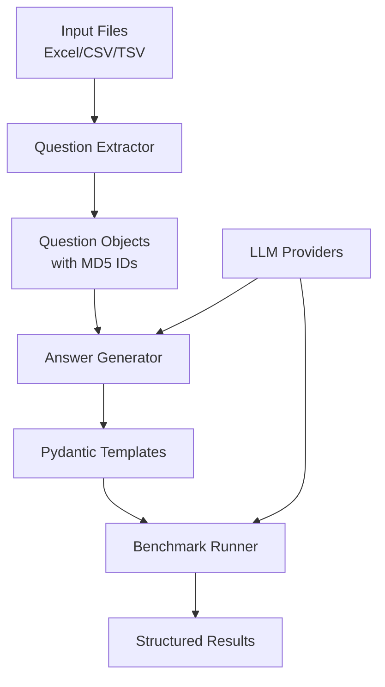

# Architecture Overview

## Core Workflow Pipeline

Karenina implements a three-stage benchmarking pipeline:



## Module Architecture

### Core Components

1. **LLM Interface** (`karenina.llm`)
   - Provider abstraction layer using LangChain
   - Session management for stateful conversations
   - Unified API across OpenAI, Google, Anthropic, OpenRouter

2. **Question Processing** (`karenina.questions`)
   - File format detection and parsing
   - MD5-based question identification
   - Flexible column mapping for data extraction

3. **Answer Templates** (`karenina.answers`)
   - Dynamic Pydantic class generation
   - LLM-powered template creation
   - Code execution and validation

4. **Benchmark Evaluation** (`karenina.benchmark`)
   - Structured response validation
   - Multi-question evaluation workflows
   - Result aggregation and reporting

### Data Models

```python
# Question schema with unique identification
class Question(BaseModel):
    id: str              # MD5 hash of question text
    question: str        # Question content
    raw_answer: str      # Expected answer
    tags: list[str]      # Classification tags

# Base class for generated answer templates
class BaseAnswer(BaseModel):
    model_config = ConfigDict(extra="allow")
```

## Provider Abstraction

The LLM interface provides unified access to multiple providers:

```python
# Unified initialization across providers
llm = init_chat_model_unified(
    model="gpt-4",
    provider="openai",
    interface="langchain"
)

# Session-based conversation management
session = ChatSession(session_id, model, provider)
response = call_model(model, provider, message, session_id)
```

## Code Generation Pattern

Karenina generates executable Python code for both questions and answer templates:

1. **Question Files**: Auto-generated modules containing Question instances
2. **Answer Templates**: Dynamic Pydantic classes created from LLM responses
3. **Template Execution**: Safe code execution with namespace isolation

## Error Handling

Hierarchical exception structure:

- `LLMError`: Base exception for LLM operations
- `LLMNotAvailableError`: LangChain dependency issues
- `SessionError`: Session management problems

## Performance Considerations

- **Batch Processing**: Questions processed in parallel where possible
- **Session Reuse**: Conversation context maintained across requests
- **Memory Management**: Large datasets handled with streaming
- **Caching**: File previews and templates cached for efficiency
